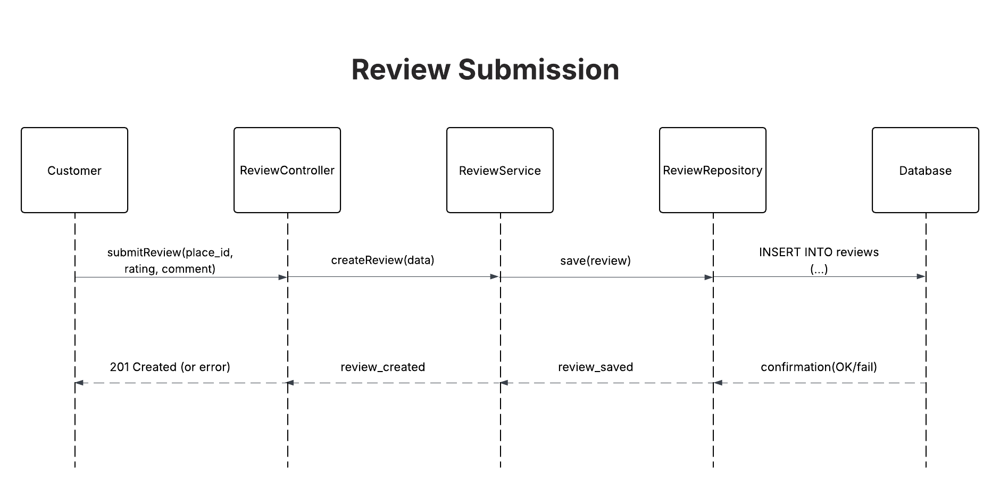

<<<<<<< HEAD
# HBnB Evolution - Documentation Technique

## Architecture Globale

### Couche Présentation
- **Responsabilités** : 
  - Gestion des routes API (Flask)
  - Sérialisation/Désérialisation JSON
  - Gestion des codes HTTP
- **Composants** :
  - `api/places.py` : Endpoints pour les lieux
  - `serializers.py` : Conversion objets ↔ JSON

### Couche Métier
- **Responsabilités** :
  - Validation des données métier
  - Implémentation des règles de gestion
  - Gestion des relations entre entités
- **Composants** :
  - `models/place.py` : Modèle Place avec méthodes métier
  - `services/place_service.py` : Logique de création des lieux

### Couche Persistence
- **Responsabilités** :
  - Abstraction de la base de données
  - Implémentation du CRUD
  - Gestion des transactions
- **Composants** :
  - `repositories/place_repository.py` : Accès DB pour les lieux
  - `database.py` : Configuration SQLAlchemy

---

## Modèle de Domaine

### Entité Place

=======
##HBnB Evolution – Technical Documentation (PART 1)
This repository contains the technical documentation for the architecture and design of the HBnB Evolution application, a project inspired by AirBnB.
The goal of this first phase is to provide a clear and detailed overview of the system prior to development, including:

A high-level architecture diagram illustrating the separation into three main layers (Presentation, Business Logic, Persistence) and their interactions via the Facade pattern.

A detailed UML class diagram describing the core entities (User, Place, Review, Amenity), their attributes, methods, and relationships.

Sequence diagrams to illustrate the primary API workflows (e.g., user registration, place creation, review submission).

Explanatory notes for each diagram to facilitate understanding and guide future implementation.

This documentation serves as a reference for the entire team, ensures project consistency, and guides the next development steps.

>>>>>>> origin/main

# THE DIAGRAMS 

    -- package_diagram.png
 
    
    ── class_diagram.png

    ── user_registration.png

<<<<<<< HEAD
── place_creation.png
=======
    ── place_creation.png

    ── add_review.png

    ── fetch_places.png 
>>>>>>> origin/main

  --diagram task 01

-- diagram de sequence task 02

